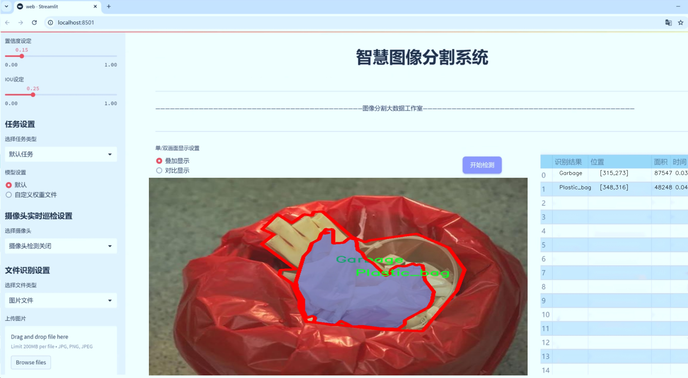
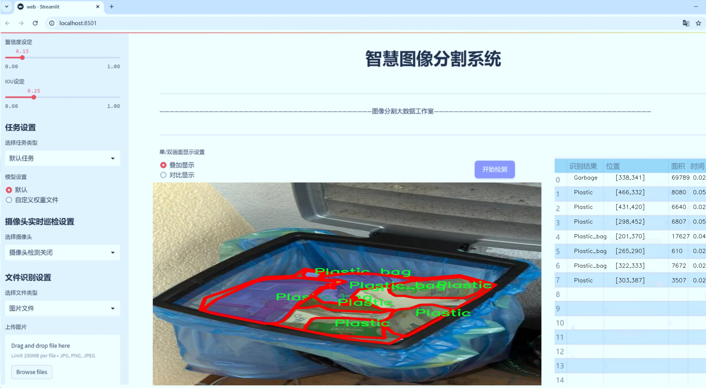
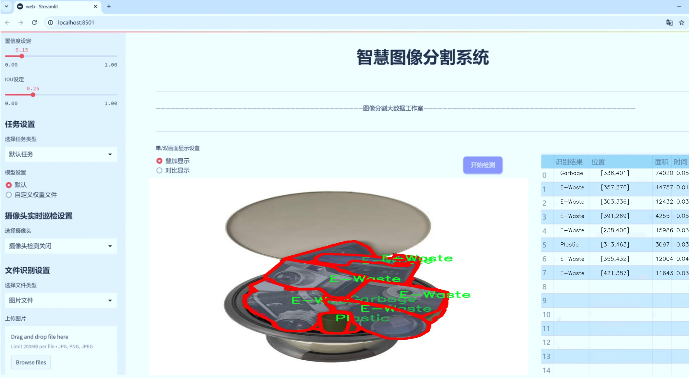
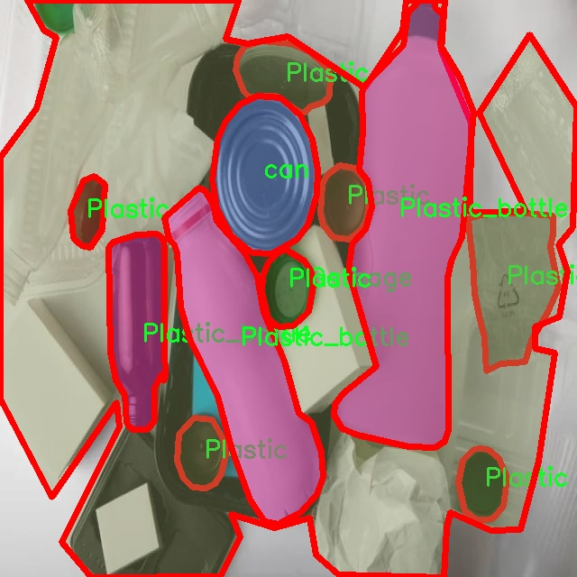
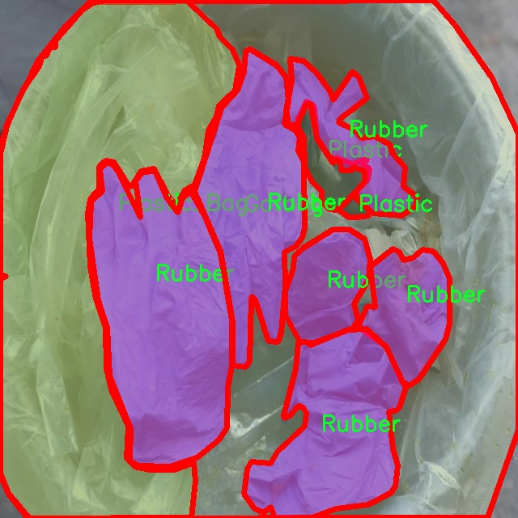
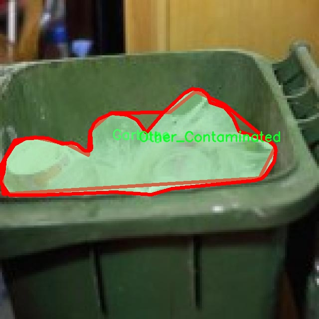
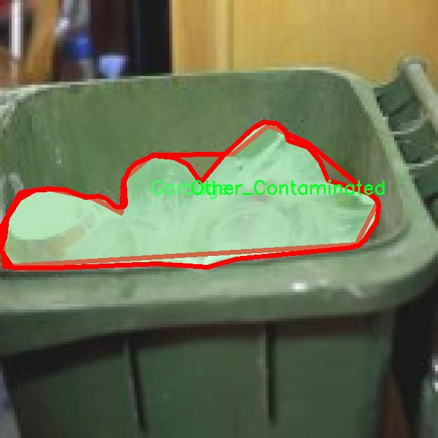
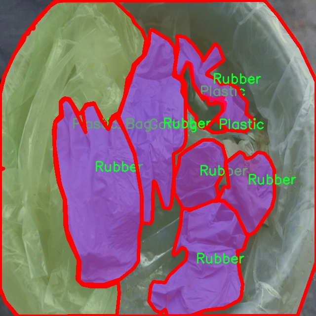

# 垃圾分类分割系统源码＆数据集分享
 [yolov8-seg-GFPN＆yolov8-seg-timm等50+全套改进创新点发刊_一键训练教程_Web前端展示]

### 1.研究背景与意义

项目参考[ILSVRC ImageNet Large Scale Visual Recognition Challenge](https://gitee.com/YOLOv8_YOLOv11_Segmentation_Studio/projects)

项目来源[AAAI Global Al lnnovation Contest](https://kdocs.cn/l/cszuIiCKVNis)

研究背景与意义

随着城市化进程的加快和人口的不断增长，垃圾产生量急剧增加，垃圾分类和处理问题日益凸显。垃圾的无序堆放不仅占用大量土地资源，还对环境造成了严重污染，影响了人们的生活质量。因此，如何有效地进行垃圾分类，提升垃圾处理效率，成为了社会各界亟待解决的重要课题。传统的垃圾分类方法往往依赖于人工识别和分类，效率低下且容易出错，无法满足现代城市对垃圾管理的需求。为此，基于深度学习的图像识别技术逐渐成为垃圾分类领域的研究热点。

YOLO（You Only Look Once）系列模型因其高效的实时目标检测能力而受到广泛关注。YOLOv8作为该系列的最新版本，在目标检测精度和速度上均有显著提升，具备了处理复杂场景的能力。然而，针对垃圾分类这一特定任务，YOLOv8的原始模型在处理细粒度的垃圾分类和分割时仍存在一定的局限性。因此，改进YOLOv8以适应垃圾分类分割的需求，成为本研究的主要目标。

本研究所使用的数据集“wastesegment_version6_13”包含4000张图像，涵盖33个垃圾类别，包括铝箔、纸板、烟蒂、一次性产品、电子废物、泡沫纸、玻璃瓶等。这些类别的多样性不仅反映了日常生活中垃圾的复杂性，也为模型的训练提供了丰富的样本。通过对这些数据的深入分析和处理，可以为垃圾分类提供更为精准的解决方案。特别是在细粒度分割方面，能够有效识别和分离不同类型的垃圾，为后续的自动化处理提供可靠的基础。

改进YOLOv8的垃圾分类分割系统，旨在通过优化模型结构和训练策略，提高其在垃圾分类任务中的表现。具体而言，本研究将探讨如何通过数据增强、迁移学习和模型集成等技术手段，提升模型的分类精度和分割效果。同时，研究还将关注模型在实际应用中的可行性，包括实时性、稳定性和易用性等方面的考量。

综上所述，基于改进YOLOv8的垃圾分类分割系统的研究，不仅具有重要的理论意义，还对实际垃圾管理工作具有深远的影响。通过提升垃圾分类的自动化水平，可以有效减少人工成本，提高垃圾处理效率，进而推动可持续发展目标的实现。此外，本研究所提出的方法和技术，亦可为其他领域的图像识别和分割任务提供借鉴，具有广泛的应用前景。

### 2.图片演示







##### 注意：由于此博客编辑较早，上面“2.图片演示”和“3.视频演示”展示的系统图片或者视频可能为老版本，新版本在老版本的基础上升级如下：（实际效果以升级的新版本为准）

  （1）适配了YOLOV8的“目标检测”模型和“实例分割”模型，通过加载相应的权重（.pt）文件即可自适应加载模型。

  （2）支持“图片识别”、“视频识别”、“摄像头实时识别”三种识别模式。

  （3）支持“图片识别”、“视频识别”、“摄像头实时识别”三种识别结果保存导出，解决手动导出（容易卡顿出现爆内存）存在的问题，识别完自动保存结果并导出到tempDir中。

  （4）支持Web前端系统中的标题、背景图等自定义修改，后面提供修改教程。

  另外本项目提供训练的数据集和训练教程,暂不提供权重文件（best.pt）,需要您按照教程进行训练后实现图片演示和Web前端界面演示的效果。

### 3.视频演示

[3.1 视频演示](https://www.bilibili.com/video/BV1QrmgYrE1p/)

### 4.数据集信息展示

##### 4.1 本项目数据集详细数据（类别数＆类别名）

nc: 33
names: ['Aluminium_foil', 'Background', 'Cardboard', 'Cig_bud', 'Cig_pack', 'Disposable', 'E-Waste', 'Foam Paper', 'Foam cups and plates', 'Garbage', 'Glass_bottle', 'Light bulbs', 'Mask', 'Metal', 'Other_Contaminated', 'Papar_Cup', 'Paper', 'Plastic', 'Plastic_Bag', 'Plastic_Container', 'Plastic_Glass', 'Plastic_Straw', 'Plastic_bag', 'Plastic_bottle', 'Plastic_wraper', 'Rubber', 'Tetrapack', 'Thermocol', 'Toothpaste', 'can', 'contaminated_waste', 'diaper', 'top_view_waste']


##### 4.2 本项目数据集信息介绍

数据集信息展示

在当今社会，垃圾分类的有效性直接影响到环境保护和资源的再利用。为了提高垃圾分类的准确性和效率，尤其是在自动化处理领域，开发一个高效的垃圾分类分割系统显得尤为重要。本研究所使用的数据集“wastesegment_version6_13”正是为此目的而精心构建的。该数据集包含33个类别，涵盖了日常生活中常见的垃圾类型，旨在为改进YOLOv8-seg模型提供丰富的训练样本。

该数据集的类别设计充分考虑了垃圾的多样性和复杂性。具体而言，类别列表包括：铝箔（Aluminium_foil）、背景（Background）、纸板（Cardboard）、烟蒂（Cig_bud）、香烟包装（Cig_pack）、一次性用品（Disposable）、电子废物（E-Waste）、泡沫纸（Foam Paper）、泡沫杯和盘子（Foam cups and plates）、垃圾（Garbage）、玻璃瓶（Glass_bottle）、灯泡（Light bulbs）、口罩（Mask）、金属（Metal）、其他污染物（Other_Contaminated）、纸杯（Papar_Cup）、纸张（Paper）、塑料（Plastic）、塑料袋（Plastic_Bag）、塑料容器（Plastic_Container）、塑料玻璃（Plastic_Glass）、塑料吸管（Plastic_Straw）、塑料袋（Plastic_bag）、塑料瓶（Plastic_bottle）、塑料包装（Plastic_wraper）、橡胶（Rubber）、纸盒（Tetrapack）、聚苯乙烯（Thermocol）、牙膏管（Toothpaste）、罐头（can）、污染废物（contaminated_waste）、尿布（diaper）以及顶视图垃圾（top_view_waste）。这样的分类不仅有助于识别不同类型的垃圾，还能为后续的分类处理提供依据。

在数据集的构建过程中，研究团队注重样本的多样性和代表性，确保每个类别都能在不同的环境和条件下得到充分的展示。这种多样性使得模型在训练过程中能够学习到更为丰富的特征，从而提升其在实际应用中的表现。数据集中的图像不仅包括各种垃圾的特写，还涵盖了不同的拍摄角度和光照条件，进一步增强了模型的鲁棒性。

此外，数据集还包含了大量的标注信息，确保每个图像中的垃圾类型都被准确地标识。这种精确的标注对于训练深度学习模型至关重要，因为它直接影响到模型的学习效果和最终的分类准确率。通过使用“wastesegment_version6_13”数据集，研究人员能够有效地训练YOLOv8-seg模型，使其在垃圾分类分割任务中达到更高的性能。

总之，“wastesegment_version6_13”数据集为改进YOLOv8-seg的垃圾分类分割系统提供了坚实的基础。通过对33个垃圾类别的全面覆盖和丰富的样本数据，该数据集不仅推动了垃圾分类技术的发展，也为环境保护贡献了一份力量。随着技术的不断进步和数据集的不断完善，未来的垃圾分类系统将更加智能化和高效化，为实现可持续发展目标奠定坚实的基础。











### 5.全套项目环境部署视频教程（零基础手把手教学）

[5.1 环境部署教程链接（零基础手把手教学）](https://www.bilibili.com/video/BV1jG4Ve4E9t/?vd_source=bc9aec86d164b67a7004b996143742dc)


[5.2 安装Python虚拟环境创建和依赖库安装视频教程链接（零基础手把手教学）](https://www.bilibili.com/video/BV1nA4VeYEze/?vd_source=bc9aec86d164b67a7004b996143742dc)

### 6.手把手YOLOV8-seg训练视频教程（零基础小白有手就能学会）

[6.1 手把手YOLOV8-seg训练视频教程（零基础小白有手就能学会）](https://www.bilibili.com/video/BV1cA4VeYETe/?vd_source=bc9aec86d164b67a7004b996143742dc)


按照上面的训练视频教程链接加载项目提供的数据集，运行train.py即可开始训练



     Epoch   gpu_mem       box       obj       cls    labels  img_size
     1/200     0G   0.01576   0.01955  0.007536        22      1280: 100%|██████████| 849/849 [14:42<00:00,  1.04s/it]
               Class     Images     Labels          P          R     mAP@.5 mAP@.5:.95: 100%|██████████| 213/213 [01:14<00:00,  2.87it/s]
                 all       3395      17314      0.994      0.957      0.0957      0.0843

     Epoch   gpu_mem       box       obj       cls    labels  img_size
     2/200     0G   0.01578   0.01923  0.007006        22      1280: 100%|██████████| 849/849 [14:44<00:00,  1.04s/it]
               Class     Images     Labels          P          R     mAP@.5 mAP@.5:.95: 100%|██████████| 213/213 [01:12<00:00,  2.95it/s]
                 all       3395      17314      0.996      0.956      0.0957      0.0845

     Epoch   gpu_mem       box       obj       cls    labels  img_size
     3/200     0G   0.01561    0.0191  0.006895        27      1280: 100%|██████████| 849/849 [10:56<00:00,  1.29it/s]
               Class     Images     Labels          P          R     mAP@.5 mAP@.5:.95: 100%|███████   | 187/213 [00:52<00:00,  4.04it/s]
                 all       3395      17314      0.996      0.957      0.0957      0.0845


### 7.50+种全套YOLOV8-seg创新点代码加载调参视频教程（一键加载写好的改进模型的配置文件）

[7.1 50+种全套YOLOV8-seg创新点代码加载调参视频教程（一键加载写好的改进模型的配置文件）](https://www.bilibili.com/video/BV1Hw4VePEXv/?vd_source=bc9aec86d164b67a7004b996143742dc)

### 8.YOLOV8-seg图像分割算法原理

原始YOLOv8-seg算法原理

YOLOv8-seg算法是YOLO系列中的最新版本，旨在实现更高效的目标检测与分割。相较于其前身YOLOv5，YOLOv8在检测精度和速度上都取得了显著的提升。该算法不仅延续了YOLO系列一贯的高效性，还引入了一系列新的技术和结构，以适应不同的应用场景和需求。YOLOv8的设计分为多个模块，包括输入端、骨干网络、颈部网络和头部网络，每个模块都经过精心设计，以实现更好的性能。

在输入端，YOLOv8采用了马赛克数据增强、自适应锚框计算和自适应灰度填充等技术。马赛克数据增强的使用，虽然可以提高模型的鲁棒性和泛化能力，但在训练的最后阶段，YOLOv8选择停止使用这一技术，以避免对数据真实分布的破坏。自适应锚框计算则使得模型能够根据输入数据的特征动态调整锚框的大小和形状，从而提高检测的准确性。

骨干网络部分，YOLOv8引入了C2f模块和SPPF（Spatial Pyramid Pooling Fusion）结构。C2f模块的设计灵感来源于YOLOv7的ELAN结构，通过增加更多的分支和跨层连接，增强了模型的梯度流动性，使得特征表示能力更强。C2f模块不仅保留了YOLOv5中的基本结构，还通过改进实现了更轻量化的设计。SPPF结构则用于在不同尺度上提取特征，进一步增强了模型对多尺度目标的检测能力。

颈部网络采用了路径聚合网络（PAN）结构，旨在加强不同尺度特征的融合能力。通过自下而上的特征融合，YOLOv8能够有效整合浅层和深层特征，从而提升对复杂场景中目标的检测能力。颈部网络的设计确保了模型在处理不同大小和形状的目标时，能够保持较高的准确性和效率。

头部网络是YOLOv8的关键部分，它将分类和检测过程进行了有效解耦。通过采用解耦头结构，YOLOv8能够分别优化分类和回归任务，提升了模型的收敛速度和预测精度。头部网络中，YOLOv8使用了无锚框检测头，直接预测目标的中心位置，减少了锚框预测的数量，从而加速了非最大抑制（NMS）过程。此外，YOLOv8还引入了Task-Aligned Assigner匹配策略，根据分类与回归的分数加权结果选择正样本，进一步提升了模型的检测性能。

在损失计算方面，YOLOv8结合了多种损失函数，包括二元交叉熵损失（BCELoss）、分布焦点损失（DFLoss）和完全交并比损失（CIOULoss）。这些损失函数的组合，使得模型在训练过程中能够更好地处理正负样本的不平衡问题，尤其是在面对小目标时，能够有效提升检测精度。

YOLOv8的模型结构在设计上也考虑到了轻量化的需求，尤其是在YOLOv8n版本中，参数量最小且检测速度最快。通过精简模型结构，YOLOv8在保持高精度的同时，确保了模型的实时性，适合在资源受限的环境中部署。与之前的YOLO系列模型相比，YOLOv8在同样的模型尺寸下，取得了更好的检测精度和更快的推理速度，展现出其在目标检测领域的强大竞争力。

总的来说，YOLOv8-seg算法通过引入先进的网络结构和优化策略，实现了在目标检测和分割任务中的显著性能提升。其模块化设计使得模型能够灵活适应不同的应用场景，成为当前目标检测领域的一项重要进展。随着YOLOv8的推广和应用，预计将为计算机视觉的进一步发展带来新的机遇和挑战。


### 9.系统功能展示（检测对象为举例，实际内容以本项目数据集为准）

图9.1.系统支持检测结果表格显示

  图9.2.系统支持置信度和IOU阈值手动调节

  图9.3.系统支持自定义加载权重文件best.pt(需要你通过步骤5中训练获得)

  图9.4.系统支持摄像头实时识别

  图9.5.系统支持图片识别

  图9.6.系统支持视频识别

  图9.7.系统支持识别结果文件自动保存

  图9.8.系统支持Excel导出检测结果数据


### 10.50+种全套YOLOV8-seg创新点原理讲解（非科班也可以轻松写刊发刊，V11版本正在科研待更新）

#### 10.1 由于篇幅限制，每个创新点的具体原理讲解就不一一展开，具体见下列网址中的创新点对应子项目的技术原理博客网址【Blog】：


[10.1 50+种全套YOLOV8-seg创新点原理讲解链接](https://gitee.com/qunmasj/good)

#### 10.2 部分改进模块原理讲解(完整的改进原理见上图和技术博客链接)【如果此小节的图加载失败可以通过CSDN或者Github搜索该博客的标题访问原始博客，原始博客图片显示正常】
### YOLOv8简介
目前YOLO系列的SOTA模型是ultralytics公司于2023年发布的YOLOv8.按照模型宽度和深度不同分为YOLOv8n、YOLOv8s、YOLOv8m、YOLOv81、YOLOv8x五个版本。本文改进的是 YOLOv8n模型。
YOLOv8的 Backbone采用CSPDarknet结构，它是 Darknet 的一种改进，引入CSP改善网络结构。CSPDarknet把特征图分为两部分，一部分进行卷积操作，另一部分进行跳跃连接，在保持网络深度的同时减少参数量和计算量，提高网络效率。Neck 部分采用特征金字塔PANet[17]，通过自顶向下路径结合和自底向上特征传播进行多尺度融合。损失函数采用了CIloU[18]。YOLOv8的网络结构如图所示。


### ParC融合位置感知循环卷积简介
ParC：Position aware circular convolution


#### Position aware circular convolution
针对于全局信息的提取作者提出了Position aware circular convolution（也称作Global Circular Convolution）。图中左右实际是对于该操作水平竖直两方向的对称，理解时只看左边即可。对于维度为C*H*W的输入，作者先将维度为C*B*1的Position Embedding通过双线性插值函数F调整到适合input的维度C*H*1（以适应不同特征大小输入），并且将PE水平复制扩展到C*H*W维度与输入特征相加。这里作者将PE直接设置成为了可学习的参数。

接下来参考该博客将加入PE的特征图竖直方向堆叠，并且同样以插值的方式得到了适应输入维度的C*H*1大小的卷积核，进行卷积操作。对于这一步卷积，作者将之称为循环卷积，并给出了一个卷积示意图。


但个人感觉实际上这个示意图只是为了说明为什么叫循环卷积，对于具体的计算细节还是根据公式理解更好。


进一步，作者给出了这一步的伪代码来便于读者对这一卷积的理解：y=F.conv2D（torch.cat（xp，xp，dim=2），kV），实际上就是将xp堆叠之后使用了一个“条形（或柱形）”卷积核进行简单的卷积操作。（但这样会导致多一次重复卷积，因此在堆叠示意图中只取了前2*H-1行）

可以看到在示意图中特征维度变化如下：C*(2H-1)*W ---C*H*1--->C*H*W，作者特意带上了通道数，并且并没有出现通道数的改变，那么这里所进行的卷积应该是depth wise卷积，通过对文章后续以及论文源码的阅读可以得知这一步进行的就是DW卷积。（we introduce group convolution and point wise convolution into these modules, which decreases number of parameters without hurting performance.）


由groups = channel可知使用的是DW卷积
通过上面就完成了一次竖直方向的全局信息交流，同样只要在水平方向进行同样的操作即可做到水平方向的全局信息交流。

#### ParC block

通过ParC成功解决了全局信息提取的问题，接下来就是针对2）3）两点进行改进。首先是Meta-Former模块，Meta-Former由Token Mixer和Channel Mixer构成，ParC首先满足了Token Mixer的全局信息提取的要求，并且相较于Attention在计算成本上更低。


这里①中的PWC即point wise conv，进一步验证了我们前面对于深度可分离卷积的想法，而GCC-H/V即是前面所说的ParC-H/V。

①构建了Meta-Former中的Token mixer模块，那么最后剩下的问题就是3），替换掉Attention模块之后模型不再data driven。为了解决这一点作者给出了一个channel wise attention，先将特征图（x,C*H*W）进行global average（a,C*1*1）并输入一个MLP生成一个channel wise的权重（w,C*1*1），再将权重与特征图在通道方向相乘得到输出（output = wx,C*H*W）。

#### ParC net
对于ParC net 的搭建，作者直接基于MobileViT，采用了分叉结构（c）完成了网络的搭建。


具体而言作者保留了MobileViT中浅层具有局部感受野的MobileNetV2结构，而将网络深层的ViT block替换成了ParC block，使网络变成了一个pure ConvNet。


### 11.项目核心源码讲解（再也不用担心看不懂代码逻辑）

#### 11.1 ultralytics\utils\torch_utils.py

以下是经过简化和注释的核心代码部分，主要保留了模型训练和推理中最重要的功能。注释详细解释了每个函数的目的和功能。

```python
import math
import os
import platform
import random
import time
from contextlib import contextmanager
from copy import deepcopy
from pathlib import Path
from typing import Union

import numpy as np
import torch
import torch.nn as nn
import torch.nn.functional as F

# 检查 PyTorch 版本
TORCH_1_9 = torch.__version__ >= '1.9.0'
TORCH_2_0 = torch.__version__ >= '2.0.0'

@contextmanager
def torch_distributed_zero_first(local_rank: int):
    """在分布式训练中，确保所有进程等待本地主进程完成某些操作。"""
    initialized = torch.distributed.is_available() and torch.distributed.is_initialized()
    if initialized and local_rank not in (-1, 0):
        torch.distributed.barrier(device_ids=[local_rank])  # 同步
    yield
    if initialized and local_rank == 0:
        torch.distributed.barrier(device_ids=[0])  # 同步

def select_device(device='', batch=0, verbose=True):
    """
    根据提供的参数选择合适的 PyTorch 设备（CPU 或 GPU）。
    """
    if isinstance(device, torch.device):
        return device

    device = str(device).lower().replace(' ', '')  # 处理设备字符串
    cpu = device == 'cpu'
    if cpu:
        os.environ['CUDA_VISIBLE_DEVICES'] = '-1'  # 强制使用 CPU
    else:
        os.environ['CUDA_VISIBLE_DEVICES'] = device  # 设置可见设备
        if not (torch.cuda.is_available() and torch.cuda.device_count() >= len(device.split(','))):
            raise ValueError(f"无效的 CUDA 设备: {device}")

    return torch.device('cpu' if cpu else 'cuda:0')  # 返回选择的设备

def time_sync():
    """返回 PyTorch 精确的时间。"""
    if torch.cuda.is_available():
        torch.cuda.synchronize()  # 同步 CUDA
    return time.time()

def fuse_conv_and_bn(conv, bn):
    """融合 Conv2d 和 BatchNorm2d 层以提高推理速度。"""
    fusedconv = nn.Conv2d(conv.in_channels, conv.out_channels, kernel_size=conv.kernel_size,
                          stride=conv.stride, padding=conv.padding, bias=True).requires_grad_(False).to(conv.weight.device)

    # 准备卷积权重
    w_conv = conv.weight.clone().view(conv.out_channels, -1)
    w_bn = torch.diag(bn.weight / torch.sqrt(bn.running_var + bn.eps))
    fusedconv.weight.copy_(torch.mm(w_bn, w_conv).view(fusedconv.weight.shape))

    # 准备偏置
    b_conv = conv.bias if conv.bias is not None else torch.zeros(conv.out_channels, device=conv.weight.device)
    b_bn = bn.bias - bn.weight * bn.running_mean / torch.sqrt(bn.running_var + bn.eps)
    fusedconv.bias.copy_(torch.mm(w_bn, b_conv.view(-1, 1)).view(-1) + b_bn)

    return fusedconv

def initialize_weights(model):
    """初始化模型权重为随机值。"""
    for m in model.modules():
        if isinstance(m, nn.Conv2d):
            nn.init.kaiming_normal_(m.weight, mode='fan_out', nonlinearity='relu')  # Kaiming 初始化
        elif isinstance(m, nn.BatchNorm2d):
            m.eps = 1e-3
            m.momentum = 0.03

def get_num_params(model):
    """返回 YOLO 模型中的参数总数。"""
    return sum(p.numel() for p in model.parameters())

def model_info(model, verbose=True):
    """打印模型信息，包括参数数量和层数。"""
    if not verbose:
        return
    n_p = get_num_params(model)  # 参数数量
    n_l = len(list(model.modules()))  # 层数
    print(f'Model summary: {n_l} layers, {n_p} parameters')

class EarlyStopping:
    """早停类，当指定的 epochs 数量内没有改进时停止训练。"""

    def __init__(self, patience=50):
        self.best_fitness = 0.0  # 最佳适应度
        self.best_epoch = 0
        self.patience = patience  # 等待的 epochs 数量

    def __call__(self, epoch, fitness):
        """检查是否停止训练。"""
        if fitness is None:
            return False

        if fitness >= self.best_fitness:  # 如果当前适应度更好
            self.best_epoch = epoch
            self.best_fitness = fitness
        return (epoch - self.best_epoch) >= self.patience  # 检查是否达到耐心值
```

### 主要功能概述：
1. **设备选择**：根据可用的设备（CPU/GPU）选择合适的 PyTorch 设备。
2. **时间同步**：提供准确的时间测量，尤其是在使用 CUDA 时。
3. **层融合**：通过融合卷积层和批归一化层来提高推理速度。
4. **权重初始化**：初始化模型的权重，以便于训练。
5. **模型信息**：打印模型的参数数量和层数，便于了解模型的复杂性。
6. **早停机制**：在训练过程中监控模型的性能，如果在一定的 epochs 内没有改进，则停止训练。

以上代码保留了 YOLO 模型训练和推理的核心功能，并进行了详细的中文注释，便于理解每个部分的作用。

这个文件是Ultralytics YOLO项目中的一个工具模块，主要用于与PyTorch相关的功能和操作。代码中包含了多个函数和类，涵盖了模型训练、设备选择、模型参数管理、性能分析等多个方面。

首先，文件导入了一些必要的库，包括数学运算、操作系统、随机数生成、时间处理、上下文管理器、深拷贝、路径处理以及类型提示等。接着，它还导入了NumPy和PyTorch的相关模块，并检查了PyTorch的版本，以确保兼容性。

在分布式训练中，`torch_distributed_zero_first`装饰器用于确保所有进程在本地主节点完成某些操作之前等待。`smart_inference_mode`函数根据PyTorch的版本选择合适的推理模式，提供了一种智能的方式来处理推理。

`select_device`函数用于选择合适的PyTorch设备（CPU或GPU），并根据可用设备和批量大小进行验证。它会设置环境变量`CUDA_VISIBLE_DEVICES`，以确保只使用指定的GPU。函数中还包含了对多GPU使用的检查，确保批量大小是设备数量的倍数。

`time_sync`函数用于同步CUDA设备的时间，以便准确测量时间。`fuse_conv_and_bn`和`fuse_deconv_and_bn`函数用于将卷积层和批归一化层融合，以提高模型的推理速度。

`model_info`函数提供了模型的详细信息，包括参数数量、梯度数量和层数。它还可以输出每一层的详细参数信息，帮助用户了解模型结构。`get_num_params`和`get_num_gradients`函数分别用于获取模型的参数总数和具有梯度的参数总数。

在性能分析方面，`get_flops`和`get_flops_with_torch_profiler`函数用于计算模型的FLOPs（每秒浮点运算次数），帮助用户评估模型的计算复杂度。`initialize_weights`函数用于初始化模型的权重。

`scale_img`函数用于根据给定的比例和网格大小缩放和填充图像张量。`make_divisible`函数用于确保一个数可以被指定的除数整除，常用于调整模型参数。

`copy_attr`函数用于从一个对象复制属性到另一个对象，`intersect_dicts`函数用于返回两个字典中具有相同形状的交集键。`is_parallel`和`de_parallel`函数用于检查模型是否为并行模型，并返回单GPU模型。

`one_cycle`函数返回一个用于从y1到y2的正弦波形函数，`init_seeds`函数用于初始化随机数生成器的种子，以确保实验的可重复性。

`ModelEMA`类实现了模型的指数移动平均（EMA），用于在训练过程中保持模型参数的平滑更新。`strip_optimizer`函数用于从模型中去除优化器，以便在训练完成后保存最终模型。

`profile`函数用于分析模型的速度、内存和FLOPs，帮助用户评估模型的性能。最后，`EarlyStopping`类用于实现早停机制，当在指定的训练轮数内没有性能提升时，自动停止训练。

整体来看，这个文件提供了丰富的工具函数和类，旨在简化YOLO模型的训练和推理过程，提高模型的性能和可用性。

#### 11.2 ui.py

```python
import sys
import subprocess

def run_script(script_path):
    """
    使用当前 Python 环境运行指定的脚本。

    Args:
        script_path (str): 要运行的脚本路径

    Returns:
        None
    """
    # 获取当前 Python 解释器的路径
    python_path = sys.executable

    # 构建运行命令，使用 streamlit 运行指定的脚本
    command = f'"{python_path}" -m streamlit run "{script_path}"'

    # 执行命令并等待其完成
    result = subprocess.run(command, shell=True)
    
    # 检查命令执行结果，如果返回码不为0，则表示出错
    if result.returncode != 0:
        print("脚本运行出错。")


# 主程序入口
if __name__ == "__main__":
    # 指定要运行的脚本路径
    script_path = "web.py"  # 这里可以直接指定脚本名，假设它在当前目录下

    # 调用函数运行脚本
    run_script(script_path)
```

### 代码注释说明：
1. **导入模块**：
   - `sys`：用于获取当前 Python 解释器的路径。
   - `subprocess`：用于执行外部命令。

2. **定义 `run_script` 函数**：
   - 接受一个参数 `script_path`，表示要运行的 Python 脚本的路径。
   - 使用 `sys.executable` 获取当前 Python 解释器的路径，以确保在正确的环境中运行脚本。
   - 构建一个命令字符串，使用 `streamlit` 模块运行指定的脚本。
   - 使用 `subprocess.run` 执行命令，并等待其完成。
   - 检查命令的返回码，如果不为0，表示脚本运行出错，打印错误信息。

3. **主程序入口**：
   - 使用 `if __name__ == "__main__":` 确保只有在直接运行该脚本时才会执行以下代码。
   - 指定要运行的脚本路径（这里假设脚本 `web.py` 在当前目录下）。
   - 调用 `run_script` 函数来执行指定的脚本。

这个程序文件名为 `ui.py`，主要功能是使用当前的 Python 环境来运行一个指定的脚本，具体是通过 Streamlit 来启动一个 Web 应用。

首先，程序导入了必要的模块，包括 `sys`、`os` 和 `subprocess`。其中，`sys` 模块用于访问与 Python 解释器相关的变量和函数，`os` 模块提供了与操作系统交互的功能，而 `subprocess` 模块则用于创建新进程、连接到它们的输入/输出/错误管道，并获取它们的返回码。

接下来，程序从 `QtFusion.path` 模块中导入了 `abs_path` 函数，这个函数的作用是获取给定路径的绝对路径。

在 `run_script` 函数中，程序接受一个参数 `script_path`，这是要运行的脚本的路径。函数内部首先获取当前 Python 解释器的路径，并将其存储在 `python_path` 变量中。然后，构建一个命令字符串，使用 `streamlit run` 命令来运行指定的脚本。这个命令将被传递给 `subprocess.run` 函数，后者会在一个新的 shell 中执行这个命令。

执行命令后，程序检查返回码，如果返回码不为零，表示脚本运行过程中出现了错误，此时会打印出“脚本运行出错。”的提示信息。

在文件的最后部分，使用 `if __name__ == "__main__":` 语句来确保只有在直接运行该脚本时才会执行下面的代码。在这里，程序指定了要运行的脚本路径 `script_path`，这个路径是通过调用 `abs_path` 函数获取的，传入的参数是 `"web.py"`。最后，调用 `run_script` 函数来执行这个脚本。

总的来说，这个程序的主要功能是为用户提供一个简单的接口，通过指定脚本路径来启动一个基于 Streamlit 的 Web 应用。

#### 11.3 ultralytics\trackers\bot_sort.py

以下是代码中最核心的部分，并附上详细的中文注释：

```python
class BOTrack(STrack):
    """
    BOTrack类是STrack类的扩展版本，添加了目标跟踪功能。
    """

    shared_kalman = KalmanFilterXYWH()  # 所有BOTrack实例共享的卡尔曼滤波器

    def __init__(self, tlwh, score, cls, feat=None, feat_history=50):
        """初始化BOTrack实例，设置初始参数和特征历史记录。"""
        super().__init__(tlwh, score, cls)  # 调用父类构造函数

        self.smooth_feat = None  # 平滑特征向量
        self.curr_feat = None  # 当前特征向量
        if feat is not None:
            self.update_features(feat)  # 如果提供特征，则更新特征
        self.features = deque([], maxlen=feat_history)  # 存储特征向量的双端队列，最大长度为feat_history
        self.alpha = 0.9  # 指数移动平均的平滑因子

    def update_features(self, feat):
        """更新特征向量，并使用指数移动平均进行平滑处理。"""
        feat /= np.linalg.norm(feat)  # 归一化特征向量
        self.curr_feat = feat  # 更新当前特征
        if self.smooth_feat is None:
            self.smooth_feat = feat  # 如果平滑特征为空，则直接赋值
        else:
            # 使用指数移动平均更新平滑特征
            self.smooth_feat = self.alpha * self.smooth_feat + (1 - self.alpha) * feat
        self.features.append(feat)  # 将当前特征添加到特征队列
        self.smooth_feat /= np.linalg.norm(self.smooth_feat)  # 归一化平滑特征

    def predict(self):
        """使用卡尔曼滤波器预测均值和协方差。"""
        mean_state = self.mean.copy()  # 复制当前均值状态
        if self.state != TrackState.Tracked:
            mean_state[6] = 0  # 如果状态不是跟踪状态，重置速度
            mean_state[7] = 0

        # 通过卡尔曼滤波器进行预测
        self.mean, self.covariance = self.kalman_filter.predict(mean_state, self.covariance)

    @property
    def tlwh(self):
        """获取当前边界框位置，格式为(左上角x, 左上角y, 宽度, 高度)。"""
        if self.mean is None:
            return self._tlwh.copy()  # 如果均值为空，返回原始边界框
        ret = self.mean[:4].copy()  # 复制均值的前四个元素
        ret[:2] -= ret[2:] / 2  # 计算左上角坐标
        return ret

    @staticmethod
    def multi_predict(stracks):
        """使用共享的卡尔曼滤波器预测多个目标轨迹的均值和协方差。"""
        if len(stracks) <= 0:
            return  # 如果没有轨迹，直接返回
        multi_mean = np.asarray([st.mean.copy() for st in stracks])  # 复制所有轨迹的均值
        multi_covariance = np.asarray([st.covariance for st in stracks])  # 复制所有轨迹的协方差
        for i, st in enumerate(stracks):
            if st.state != TrackState.Tracked:
                multi_mean[i][6] = 0  # 重置未跟踪状态的速度
                multi_mean[i][7] = 0
        # 使用共享的卡尔曼滤波器进行多目标预测
        multi_mean, multi_covariance = BOTrack.shared_kalman.multi_predict(multi_mean, multi_covariance)
        for i, (mean, cov) in enumerate(zip(multi_mean, multi_covariance)):
            stracks[i].mean = mean  # 更新轨迹的均值
            stracks[i].covariance = cov  # 更新轨迹的协方差
```

### 代码核心部分说明：
1. **BOTrack类**：该类扩展了STrack类，增加了目标跟踪的功能。
2. **共享卡尔曼滤波器**：所有BOTrack实例共享一个卡尔曼滤波器，用于状态预测。
3. **特征更新**：通过`update_features`方法，特征向量被更新并进行平滑处理，以便更好地跟踪目标。
4. **预测功能**：`predict`方法使用卡尔曼滤波器预测目标的状态。
5. **边界框格式**：`tlwh`属性提供了当前目标的边界框位置。
6. **多目标预测**：`multi_predict`静态方法允许同时预测多个目标的状态，利用共享的卡尔曼滤波器提高效率。

这个程序文件是一个用于目标跟踪的实现，特别是针对YOLOv8模型的扩展。它包含了两个主要的类：`BOTrack`和`BOTSORT`，分别用于表示跟踪对象和实现跟踪算法。

`BOTrack`类是对`STrack`类的扩展，增加了对象跟踪的功能。它使用了卡尔曼滤波器来预测目标的位置，并且实现了特征向量的更新与平滑。该类的构造函数接收目标的边界框信息、置信度、类别和特征向量，并初始化一些属性，如平滑特征、当前特征和特征历史记录。`update_features`方法用于更新特征向量，并通过指数移动平均进行平滑处理。`predict`方法则利用卡尔曼滤波器预测目标的状态。`re_activate`和`update`方法用于重新激活和更新跟踪对象，确保跟踪状态的持续性。`tlwh`属性提供了当前目标的位置，以特定格式返回边界框信息。此外，`multi_predict`静态方法可以对多个目标进行状态预测，`convert_coords`和`tlwh_to_xywh`方法用于坐标格式的转换。

`BOTSORT`类是对`BYTETracker`类的扩展，设计用于结合ReID（重识别）和GMC（全局运动一致性）算法进行目标跟踪。构造函数初始化了一些参数，包括空间接近度和外观相似度的阈值，以及ReID模块和GMC实例。`get_kalmanfilter`方法返回一个卡尔曼滤波器的实例。`init_track`方法用于根据检测结果初始化跟踪对象，如果启用了ReID，还会提取特征。`get_dists`方法计算跟踪对象与检测对象之间的距离，结合了IoU和ReID特征的相似度。`multi_predict`方法则调用`BOTrack`的多目标预测方法，以实现对多个对象的跟踪。

总体而言，这个文件实现了一个基于YOLOv8的目标跟踪系统，结合了运动预测和外观特征匹配的技术，适用于复杂的跟踪场景。

#### 11.4 ultralytics\engine\validator.py

以下是经过简化并添加详细中文注释的核心代码部分：

```python
import json
import time
from pathlib import Path
import numpy as np
import torch
from ultralytics.cfg import get_cfg, get_save_dir
from ultralytics.nn.autobackend import AutoBackend
from ultralytics.utils import LOGGER, TQDM, callbacks
from ultralytics.utils.checks import check_imgsz
from ultralytics.utils.ops import Profile
from ultralytics.utils.torch_utils import select_device, smart_inference_mode

class BaseValidator:
    """
    BaseValidator类用于创建验证器的基类。
    """

    def __init__(self, dataloader=None, save_dir=None, args=None, _callbacks=None):
        """
        初始化BaseValidator实例。

        参数:
            dataloader (torch.utils.data.DataLoader): 用于验证的数据加载器。
            save_dir (Path, optional): 保存结果的目录。
            args (SimpleNamespace): 验证器的配置。
            _callbacks (dict): 存储各种回调函数的字典。
        """
        self.args = get_cfg(overrides=args)  # 获取配置
        self.dataloader = dataloader  # 数据加载器
        self.save_dir = save_dir or get_save_dir(self.args)  # 保存目录
        self.speed = {'preprocess': 0.0, 'inference': 0.0, 'loss': 0.0, 'postprocess': 0.0}  # 速度统计
        self.callbacks = _callbacks or callbacks.get_default_callbacks()  # 回调函数

    @smart_inference_mode()
    def __call__(self, trainer=None, model=None):
        """
        支持验证预训练模型或正在训练的模型。
        """
        self.training = trainer is not None  # 判断是否在训练模式
        if self.training:
            self.device = trainer.device  # 获取设备
            model = trainer.model  # 获取模型
            model.eval()  # 设置模型为评估模式
        else:
            model = AutoBackend(model or self.args.model, device=select_device(self.args.device), fp16=self.args.half)
            self.device = model.device  # 更新设备
            self.dataloader = self.dataloader or self.get_dataloader(self.args.data, self.args.batch)  # 获取数据加载器
            model.eval()  # 设置模型为评估模式

        # 运行验证过程
        for batch_i, batch in enumerate(TQDM(self.dataloader)):
            # 预处理
            batch = self.preprocess(batch)

            # 推理
            preds = model(batch['img'])

            # 更新指标
            self.update_metrics(preds, batch)

        # 获取统计信息
        stats = self.get_stats()
        self.print_results()  # 打印结果
        return stats  # 返回统计信息

    def preprocess(self, batch):
        """预处理输入批次。"""
        return batch  # 这里可以添加具体的预处理逻辑

    def update_metrics(self, preds, batch):
        """根据预测和批次更新指标。"""
        pass  # 这里可以添加更新指标的逻辑

    def get_stats(self):
        """返回模型性能的统计信息。"""
        return {}  # 这里可以返回具体的统计信息

    def print_results(self):
        """打印模型预测的结果。"""
        pass  # 这里可以添加打印结果的逻辑

    def get_dataloader(self, dataset_path, batch_size):
        """从数据集路径和批次大小获取数据加载器。"""
        raise NotImplementedError('get_dataloader函数未在此验证器中实现')
```

### 代码注释说明：
1. **类的初始化**：`__init__`方法中初始化了验证器的基本配置，包括数据加载器、保存目录和回调函数。
2. **调用方法**：`__call__`方法是验证的核心，支持对模型进行推理和验证，并更新指标。
3. **预处理**：`preprocess`方法用于对输入数据进行预处理，可以根据需要扩展具体的逻辑。
4. **更新指标**：`update_metrics`方法用于更新模型的性能指标，具体逻辑待实现。
5. **获取统计信息**：`get_stats`方法返回模型的性能统计信息，当前返回空字典，待实现具体逻辑。
6. **打印结果**：`print_results`方法用于打印模型的预测结果，当前未实现。

这个简化版本保留了代码的核心逻辑，并通过注释解释了每个部分的功能。

这个程序文件是一个用于验证YOLO模型（You Only Look Once）的准确性的基类，名为`BaseValidator`。它的主要功能是对模型在测试集或验证集上的表现进行评估。文件开头提供了使用说明，包括如何调用验证功能以及支持的模型格式。

在`BaseValidator`类中，构造函数`__init__`初始化了一些重要的属性，包括数据加载器、保存结果的目录、进度条、模型配置等。它还检查输入图像的尺寸，并为保存结果创建必要的目录。

`__call__`方法是这个类的核心，它支持对预训练模型或正在训练的模型进行验证。根据是否传入训练器（trainer），它会设置不同的设备和数据集，并进行模型的预热。然后，它会循环遍历数据加载器中的每个批次，执行预处理、推理、损失计算和后处理等步骤，并更新相应的指标。

`match_predictions`方法用于将模型的预测结果与真实标签进行匹配，基于IoU（Intersection over Union）值来判断预测的准确性。该方法支持使用SciPy库进行更精确的匹配。

该类还定义了一些回调机制，允许在验证过程中的不同阶段运行自定义的回调函数。用户可以通过`add_callback`方法添加回调，`run_callbacks`方法则会在指定事件发生时执行这些回调。

此外，`BaseValidator`类中还有一些未实现的方法，如`get_dataloader`和`build_dataset`，这些方法需要在子类中实现，以适应具体的数据集和加载需求。

在验证过程中，程序会记录处理时间、更新性能指标，并在结束时打印结果。用户可以选择将结果保存为JSON格式，或者绘制验证样本和预测结果的图像。

总体而言，这个文件为YOLO模型的验证提供了一个灵活且可扩展的基础框架，允许用户根据需要进行自定义和扩展。

#### 11.5 ultralytics\models\rtdetr\__init__.py

以下是代码中最核心的部分，并附上详细的中文注释：

```python
# 导入必要的模块和类
from .model import RTDETR  # 从当前包的model模块中导入RTDETR类
from .predict import RTDETRPredictor  # 从当前包的predict模块中导入RTDETRPredictor类
from .val import RTDETRValidator  # 从当前包的val模块中导入RTDETRValidator类

# 定义当前模块的公开接口
__all__ = 'RTDETRPredictor', 'RTDETRValidator', 'RTDETR'  # 指定可以被外部导入的类
```

### 代码注释说明：
1. **导入模块**：
   - `from .model import RTDETR`：从当前包的 `model` 模块中导入 `RTDETR` 类，`RTDETR` 可能是一个用于目标检测的模型类。
   - `from .predict import RTDETRPredictor`：从当前包的 `predict` 模块中导入 `RTDETRPredictor` 类，`RTDETRPredictor` 可能是一个用于进行预测的类。
   - `from .val import RTDETRValidator`：从当前包的 `val` 模块中导入 `RTDETRValidator` 类，`RTDETRValidator` 可能是一个用于验证模型性能的类。

2. **定义公开接口**：
   - `__all__` 变量用于定义当前模块的公共接口，只有在使用 `from module import *` 语句时，列出的类和函数才会被导入。这里列出了 `RTDETRPredictor`、`RTDETRValidator` 和 `RTDETR` 三个类，表示它们是该模块的主要功能部分。

这个程序文件是一个Python模块的初始化文件，位于`ultralytics\models\rtdetr`目录下。文件的主要功能是导入和暴露该模块中的关键类和功能，以便其他模块可以方便地使用。

首先，文件开头的注释部分表明这个项目是Ultralytics YOLO的一部分，并且使用的是AGPL-3.0许可证。这意味着该项目是开源的，用户可以自由使用和修改，但在分发修改后的版本时需要遵循相同的许可证条款。

接下来，文件通过相对导入的方式引入了三个重要的组件：`RTDETR`、`RTDETRPredictor`和`RTDETRValidator`。这些组件分别来自于同一目录下的`model.py`、`predict.py`和`val.py`文件。具体来说：

- `RTDETR`可能是一个模型类，负责定义和构建RTDETR（Real-Time DEtection TRansformer）模型的结构和参数。
- `RTDETRPredictor`是一个预测器类，可能用于执行模型的推理，处理输入数据并生成预测结果。
- `RTDETRValidator`则可能是一个验证器类，用于评估模型的性能，计算准确率、召回率等指标。

最后，`__all__`变量定义了模块的公共接口，列出了在使用`from module import *`语句时可以导入的名称。这意味着当其他模块导入这个包时，只能访问`RTDETRPredictor`、`RTDETRValidator`和`RTDETR`这三个类，而无法访问其他未列出的内容。

总的来说，这个初始化文件的作用是组织和简化模块的使用，使得用户能够方便地访问RTDETR相关的功能和类。

#### 11.6 train.py

以下是经过简化和注释的核心代码部分：

```python
import os
import torch
import yaml
from ultralytics import YOLO  # 导入YOLO模型

if __name__ == '__main__':  # 确保该模块被直接运行时才执行以下代码
    # 设置训练参数
    workers = 1  # 数据加载的工作进程数
    batch = 8  # 每个批次的样本数量
    device = "0" if torch.cuda.is_available() else "cpu"  # 选择使用GPU还是CPU

    # 获取数据集配置文件的绝对路径
    data_path = abs_path(f'datasets/data/data.yaml', path_type='current')

    # 读取YAML文件，保持原有顺序
    with open(data_path, 'r') as file:
        data = yaml.load(file, Loader=yaml.FullLoader)

    # 修改数据集路径为绝对路径
    if 'train' in data and 'val' in data and 'test' in data:
        directory_path = os.path.dirname(data_path.replace(os.sep, '/'))  # 获取目录路径
        data['train'] = directory_path + '/train'  # 更新训练集路径
        data['val'] = directory_path + '/val'      # 更新验证集路径
        data['test'] = directory_path + '/test'    # 更新测试集路径

        # 将修改后的数据写回YAML文件
        with open(data_path, 'w') as file:
            yaml.safe_dump(data, file, sort_keys=False)

    # 加载YOLO模型
    model = YOLO(r"C:\codeseg\codenew\50+种YOLOv8算法改进源码大全和调试加载训练教程（非必要）\改进YOLOv8模型配置文件\yolov8-seg-C2f-Faster.yaml").load("./weights/yolov8s-seg.pt")

    # 开始训练模型
    results = model.train(
        data=data_path,  # 指定训练数据的配置文件路径
        device=device,    # 选择训练设备
        workers=workers,  # 指定工作进程数
        imgsz=640,        # 输入图像大小
        epochs=100,       # 训练的轮数
        batch=batch,      # 每个批次的大小
    )
```

### 代码注释说明：
1. **导入必要的库**：导入了操作系统、PyTorch、YAML处理库和YOLO模型。
2. **主程序入口**：使用`if __name__ == '__main__':`确保代码块只在直接运行时执行。
3. **设置训练参数**：
   - `workers`：指定数据加载的工作进程数。
   - `batch`：设置每个批次的样本数量。
   - `device`：根据是否有可用的GPU选择训练设备。
4. **读取和修改数据集配置**：
   - 获取数据集配置文件的绝对路径。
   - 读取YAML文件内容，并将训练、验证和测试集的路径更新为绝对路径。
   - 将修改后的内容写回YAML文件。
5. **加载YOLO模型**：根据指定的配置文件和权重文件加载YOLO模型。
6. **训练模型**：调用`model.train()`方法开始训练，传入必要的参数，如数据路径、设备、工作进程数、图像大小和训练轮数。

这个程序文件 `train.py` 是一个用于训练 YOLO（You Only Look Once）模型的脚本，主要功能是设置训练参数、加载数据集、配置模型并开始训练。以下是对代码的逐行讲解。

首先，程序导入了一些必要的库，包括 `os`、`torch`、`yaml` 和 `matplotlib`。其中，`torch` 是 PyTorch 框架的核心库，`yaml` 用于处理 YAML 格式的配置文件，`matplotlib` 用于图形绘制，虽然在此脚本中并未直接使用。

在 `if __name__ == '__main__':` 这一行下，确保只有当该脚本被直接运行时，以下代码才会执行。接着，程序设置了一些训练参数，包括 `workers`（数据加载的工作进程数量）、`batch`（每个批次的样本数量）和 `device`（计算设备，优先使用 GPU，如果不可用则使用 CPU）。

接下来，程序通过 `abs_path` 函数获取数据集配置文件 `data.yaml` 的绝对路径，并将路径中的分隔符统一为 Unix 风格的斜杠 `/`。然后，使用 `os.path.dirname` 获取该路径的目录部分。

程序打开 `data.yaml` 文件并读取其内容，使用 `yaml.load` 方法将 YAML 文件解析为 Python 字典。随后，程序检查字典中是否包含 `train`、`val` 和 `test` 三个键，如果存在，则更新这些键的值为相应的训练、验证和测试数据集的路径，并将修改后的内容写回到 `data.yaml` 文件中。

在模型配置部分，程序加载了一个 YOLO 模型的配置文件，并使用 `load` 方法加载预训练的权重文件。这里的模型配置文件和权重文件路径是硬编码的，用户可以根据需要进行修改。

最后，程序调用 `model.train` 方法开始训练模型，传入了训练数据的配置文件路径、计算设备、工作进程数量、输入图像大小、训练的 epoch 数量和批次大小等参数。

整体来看，这个脚本提供了一个简单的接口来配置和启动 YOLO 模型的训练过程，适合需要进行目标检测任务的用户使用。

### 12.系统整体结构（节选）

### 整体功能和构架概括

该项目是一个基于YOLO（You Only Look Once）模型的目标检测框架，主要用于训练、验证和推理。项目的结构分为多个模块，每个模块负责特定的功能，形成一个完整的目标检测工作流。以下是各个模块的主要功能：

- **模型训练**：提供训练YOLO模型的功能，包括数据加载、模型配置和训练过程管理。
- **模型验证**：实现对训练后模型的性能评估，计算准确率、召回率等指标。
- **目标跟踪**：实现基于YOLO模型的目标跟踪功能，结合外观特征和运动预测。
- **工具函数**：提供与PyTorch相关的实用工具函数，如设备选择、图像处理等。
- **用户界面**：提供一个简单的用户界面，允许用户通过Web应用与模型进行交互。
- **模型初始化**：模块化管理RTDETR模型的相关类和功能。

### 文件功能整理表

| 文件路径                                               | 功能描述                                           |
|------------------------------------------------------|---------------------------------------------------|
| `ultralytics/utils/torch_utils.py`                  | 提供与PyTorch相关的工具函数，如设备选择、模型参数管理等。 |
| `ui.py`                                             | 启动一个基于Streamlit的Web应用，允许用户与模型交互。   |
| `ultralytics/trackers/bot_sort.py`                  | 实现目标跟踪算法，结合ReID和运动预测。              |
| `ultralytics/engine/validator.py`                   | 验证模型性能的基类，评估模型在测试集上的表现。        |
| `ultralytics/models/rtdetr/__init__.py`             | 初始化RTDETR模型模块，导入关键类和功能。            |
| `train.py`                                          | 训练YOLO模型的脚本，配置训练参数并启动训练过程。    |
| `chinese_name_list.py`                              | 可能包含中文名称列表，具体功能未详细分析。          |
| `ultralytics/utils/downloads.py`                    | 提供下载功能，可能用于下载模型权重或数据集。         |
| `ultralytics/utils/callbacks/dvc.py`                | 实现与DVC（数据版本控制）相关的回调功能。            |
| `ultralytics/utils/callbacks/__init__.py`           | 初始化回调模块，导入相关回调功能。                  |
| `ultralytics/models/sam/model.py`                   | 可能实现SAM（Segment Anything Model）模型的功能。   |
| `ultralytics/models/yolo/detect/train.py`           | YOLO模型的训练脚本，专注于目标检测任务。            |
| `ultralytics/utils/metrics.py`                      | 提供性能指标计算功能，如准确率、召回率等。            |

这个表格总结了项目中各个文件的功能，帮助理解项目的整体架构和各个模块之间的关系。

注意：由于此博客编辑较早，上面“11.项目核心源码讲解（再也不用担心看不懂代码逻辑）”中部分代码可能会优化升级，仅供参考学习，完整“训练源码”、“Web前端界面”和“50+种创新点源码”以“14.完整训练+Web前端界面+50+种创新点源码、数据集获取”的内容为准。

### 13.图片、视频、摄像头图像分割Demo(去除WebUI)代码

在这个博客小节中，我们将讨论如何在不使用WebUI的情况下，实现图像分割模型的使用。本项目代码已经优化整合，方便用户将分割功能嵌入自己的项目中。
核心功能包括图片、视频、摄像头图像的分割，ROI区域的轮廓提取、类别分类、周长计算、面积计算、圆度计算以及颜色提取等。
这些功能提供了良好的二次开发基础。

### 核心代码解读

以下是主要代码片段，我们会为每一块代码进行详细的批注解释：

```python
import random
import cv2
import numpy as np
from PIL import ImageFont, ImageDraw, Image
from hashlib import md5
from model import Web_Detector
from chinese_name_list import Label_list

# 根据名称生成颜色
def generate_color_based_on_name(name):
    ......

# 计算多边形面积
def calculate_polygon_area(points):
    return cv2.contourArea(points.astype(np.float32))

...
# 绘制中文标签
def draw_with_chinese(image, text, position, font_size=20, color=(255, 0, 0)):
    image_pil = Image.fromarray(cv2.cvtColor(image, cv2.COLOR_BGR2RGB))
    draw = ImageDraw.Draw(image_pil)
    font = ImageFont.truetype("simsun.ttc", font_size, encoding="unic")
    draw.text(position, text, font=font, fill=color)
    return cv2.cvtColor(np.array(image_pil), cv2.COLOR_RGB2BGR)

# 动态调整参数
def adjust_parameter(image_size, base_size=1000):
    max_size = max(image_size)
    return max_size / base_size

# 绘制检测结果
def draw_detections(image, info, alpha=0.2):
    name, bbox, conf, cls_id, mask = info['class_name'], info['bbox'], info['score'], info['class_id'], info['mask']
    adjust_param = adjust_parameter(image.shape[:2])
    spacing = int(20 * adjust_param)

    if mask is None:
        x1, y1, x2, y2 = bbox
        aim_frame_area = (x2 - x1) * (y2 - y1)
        cv2.rectangle(image, (x1, y1), (x2, y2), color=(0, 0, 255), thickness=int(3 * adjust_param))
        image = draw_with_chinese(image, name, (x1, y1 - int(30 * adjust_param)), font_size=int(35 * adjust_param))
        y_offset = int(50 * adjust_param)  # 类别名称上方绘制，其下方留出空间
    else:
        mask_points = np.concatenate(mask)
        aim_frame_area = calculate_polygon_area(mask_points)
        mask_color = generate_color_based_on_name(name)
        try:
            overlay = image.copy()
            cv2.fillPoly(overlay, [mask_points.astype(np.int32)], mask_color)
            image = cv2.addWeighted(overlay, 0.3, image, 0.7, 0)
            cv2.drawContours(image, [mask_points.astype(np.int32)], -1, (0, 0, 255), thickness=int(8 * adjust_param))

            # 计算面积、周长、圆度
            area = cv2.contourArea(mask_points.astype(np.int32))
            perimeter = cv2.arcLength(mask_points.astype(np.int32), True)
            ......

            # 计算色彩
            mask = np.zeros(image.shape[:2], dtype=np.uint8)
            cv2.drawContours(mask, [mask_points.astype(np.int32)], -1, 255, -1)
            color_points = cv2.findNonZero(mask)
            ......

            # 绘制类别名称
            x, y = np.min(mask_points, axis=0).astype(int)
            image = draw_with_chinese(image, name, (x, y - int(30 * adjust_param)), font_size=int(35 * adjust_param))
            y_offset = int(50 * adjust_param)

            # 绘制面积、周长、圆度和色彩值
            metrics = [("Area", area), ("Perimeter", perimeter), ("Circularity", circularity), ("Color", color_str)]
            for idx, (metric_name, metric_value) in enumerate(metrics):
                ......

    return image, aim_frame_area

# 处理每帧图像
def process_frame(model, image):
    pre_img = model.preprocess(image)
    pred = model.predict(pre_img)
    det = pred[0] if det is not None and len(det)
    if det:
        det_info = model.postprocess(pred)
        for info in det_info:
            image, _ = draw_detections(image, info)
    return image

if __name__ == "__main__":
    cls_name = Label_list
    model = Web_Detector()
    model.load_model("./weights/yolov8s-seg.pt")

    # 摄像头实时处理
    cap = cv2.VideoCapture(0)
    while cap.isOpened():
        ret, frame = cap.read()
        if not ret:
            break
        ......

    # 图片处理
    image_path = './icon/OIP.jpg'
    image = cv2.imread(image_path)
    if image is not None:
        processed_image = process_frame(model, image)
        ......

    # 视频处理
    video_path = ''  # 输入视频的路径
    cap = cv2.VideoCapture(video_path)
    while cap.isOpened():
        ret, frame = cap.read()
        ......
```


### 14.完整训练+Web前端界面+50+种创新点源码、数据集获取


# [下载链接：https://mbd.pub/o/bread/Zp2Ul5hp](https://mbd.pub/o/bread/Zp2Ul5hp)